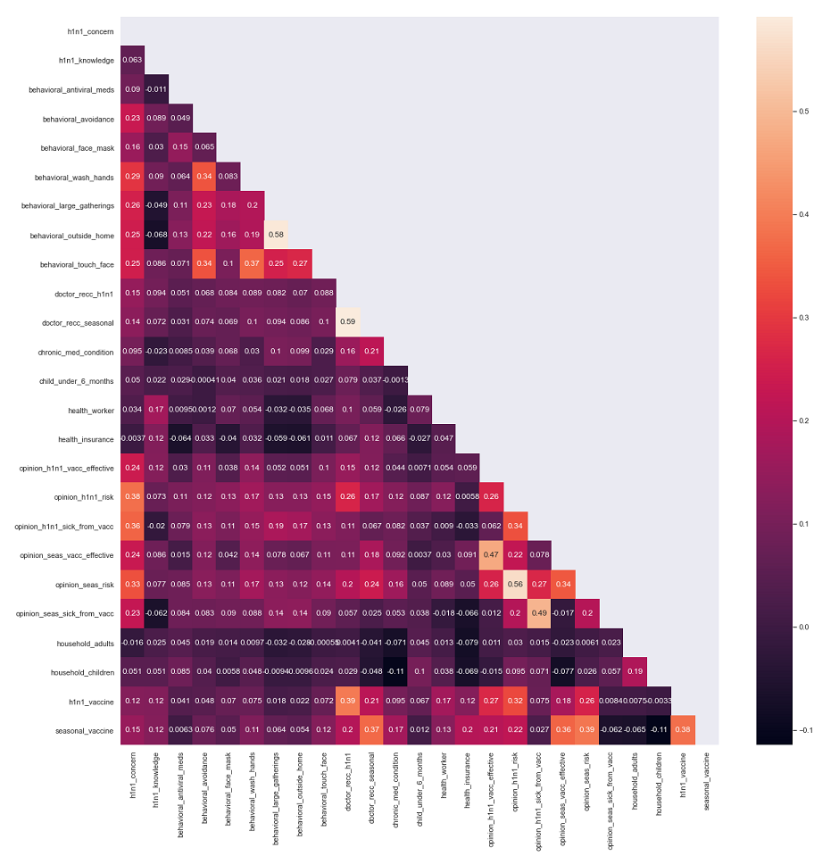
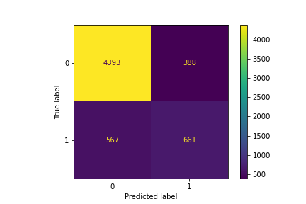
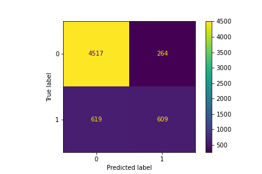
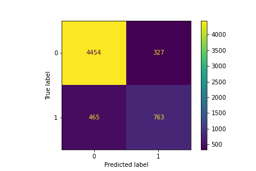
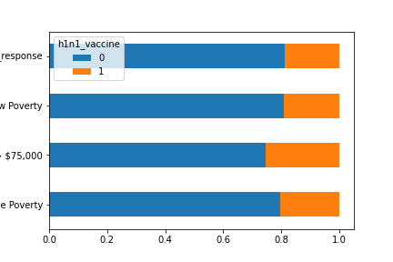

# Predictor for H1N1 Vaccination

**Author**: Samuel Song
 

## Overview

I will be analyzing data from a survey on H1N1 to help predict who will get a vaccine for any given upcoming epidemic.
 
The target audience would be campaigning for Department of Health and Human Services 

## Data and Methods

The data used consists of a feature and labels csv. They had respondent ID as index for both files, so a merge was simple. 
 
From the merged dataframe, I used X as the rest of the features and y as 'h1n1_vaccine' from the labels csv.
 
Data was provided by DrivenData.org from the contest 'Flu Shot Learning: Predict H1N1 and Seasonal Flu Vaccines' [(Link here)](https://www.drivendata.org/competitions/66/flu-shot-learning/page/210/)
 

### Notebook Guide:
Please review the full analysis in the Jupyter Notebooks: 
- [EDA and Initial Models](./code/EDA_and_Initial_Models.ipynb)
- [First 2 Models (Logreg and DTC) with most features](./code/Modeling_Work_1_Logreg_DTC.ipynb)
- [Logreg Model with less features](./code/Modeling_Work_2_Logreg.ipynb)
- [DTC Model with less features](./code/Modeling_Work_3_DTC.ipynb)
- [Presentation Here](./H1N1_Flu.pdf).

### EDA_and_Initial_Models
- This contains the inital EDA and first day models created.
- The EDA had somt great insights as to what would be correlated by using pearson's corr. 
- The models made at the end were more for understanding workflow. The following notebooks are a bit more organized models
- (Also going forward, all GridSearches will be left with the most optimal options for the sake of a quick run)
- All logs of gs performances will be in the .txt files in github.

 
 

### Modeling_Work_1_Logreg_DTC

- Contains first models made by using Logreg and DTC.
- Almost all features were used.
- Dropped features with too many nulls.
- The logs for gs performances in this notebook (Modeling_Work_1_Logreg_DTC) is under [log_dtc_model_1.txt](./log_dtc_model_1.txt) and [log_logreg_model_1.txt](./log_logreg_model_1.txt)
- Ultimately decided not to use these models because using less features, as shown in next workbooks, proved to be better.
- Image below is confusion matrix of best model

 

### Modeling_Work_2_Logreg

- Ultimately, decided not to use Logreg when GridSearched upon.
- Results were about worse.
- Best confusion matrix below for this notebook
- Logs for gs performances is under [log_logreg_model_2.txt](./log_logreg_model_2.txt)

    
 

### Modeling_Work_3_DTC

- This model provided best results.
- More features were dropped, ones deemed irrelevant from the corr map.
- Improved a bit. Best confusion matrix below. This is also the confusion matrix for best model used.
- Logs for gs performances is under [log_dtc_model_2.txt](./log_dtc_model_2.txt)

    

## Results

By dropping a few features, I was able to predict about 84.5% of the time correctly on who would get the H1N1 vaccine or not.
 

Inside the notepad files (.txt) are the logs for Gridsearches across all the notebooks. Titles

## Conclusions

Based on the strongest correlations for the model:
- It is shown that if the person is more educated about the disease itself, they will get vaccinated.
- Same with opinions on vaccinations on whether they work or not.
- The strongest and easiest to keep up is doctor reccommendations for vaccines. 
- I expected there to be a larger difference in vaccination rates for income rates. As shown below.

  
### Next Steps

- Perhaps look into why higher income families are not getting vaccinated
- Help educate the population more on vaccinations
- Keep having doctors reccomend vaccinations
- Rerun this idea on COVID instead of H1N1? Perhaps with some different questions too. May provide more  insights.
- Model may be used to predict how many vaccines will be needed in the future for whatever given epidemic?

For any additional questions, please contact Samuel Song at samueld.song@gmail.com
